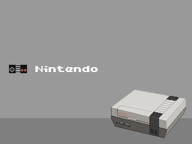
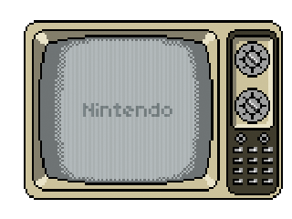
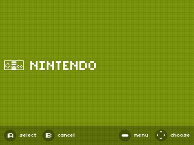
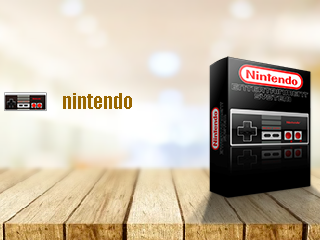
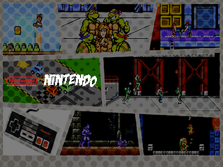
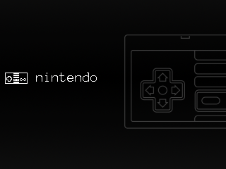
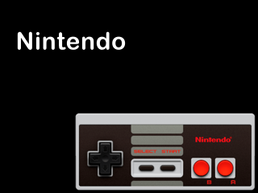

# Retro Go Themes
> Themes for [Ducalex Retro Go](https://github.com/ducalex/retro-go) and [100ASK Retro Go Yao-Mio](https://github.com/100askTeam/retro-go-yao-mio)

## Overview

This is a collection of Themes you can install for your Odroid Go that is runnning [Ducalex Retro Go](https://github.com/ducalex/retro-go) and [100ASK Retro Go Yao-Mio](https://github.com/100askTeam/retro-go-yao-mio) emulation.

## Installation
> Clone, Mount, Copy, Paste

* Mount Your SD Card
* In `retro-go` create a `themes` folder if there isn't one
* Select your *theme* from this repo
* Copy all the images from inside that theme folder
* Paste to your SD card in the `themes`
* Eject your SD Card
* Mount yoru SD Card in your Odroid Go
* Enjoy

## Current Themes
> What's available

| Theme | Preview |
|--|--|
| Pixel | |
| TV | |
| GBZ | |
| Box | |
| Comic Book | |
| Noir | |
| Clean | |

## Forum

[https://forums.100ask.net](https://forums.100ask.net)
